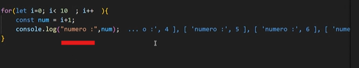

actividad de Js


```js
let numero=10;//decimal.int,bigInt,
let nombre="Luciana";
let esMayorDeEdad=true;// o false
let valorNulo=null;
let noDefinida;//undefined

console.log(valorNulo);

```
Bucle para imprimir numeros del 1 al 10.
los bucles FOR se dividen en 3 partes.
1.iniciar una variable(normalmente i)
2.crear una condicion para esa variable(ej:i<10)
3.aplicar un cambio a esa variable cadsa interaccion(ej:i++)





ejercicio 2

```js
let num1=10
const num2=5
const num3=5

let suma=num1 + num2;
let resta=num1 - num2;
let multi=num1 * num2;
let divi=num1/num2;


let esMayor=(num1>num2);//true

console.log(num1>num2); true

let esIgual=(num3==num2);//true
let esEstrictamente=(num3===num2)//false


const edad =25
if(edad >=18){
    console.log("Es mayor de edad");`Es mayor de edad`
}else{
    console.log("Es menor de edad");

}


// ver si es mayor de edad ,pero si no lo es,ver si tiene permiso para salir a bailar

if(edad>=18){
    console.log("Puedes salir a bailar");'Puedes salir a bailar'

}else{
    is(tienePermiso==true){
        console.log("Puede salir a bailar");

    }else{
        console.log("No puede salir a bailar");

    }
}

//mas resumido


if(edad>=18){
    console.log("Puedes salir a bailar");'Puedes salir a bailar'

}else if(tienePermiso==true){
        console.log("Puede salir a bailar");

    }else{
        console.log("No puede salir a bailar");

}

//Bucle para repetir una tarea.
console.log("iniciar bucle");`iniciar el bucle`


//numeros de 10 al 1
for(let i=10; i>0; i--){
    console.log("numero;", i):
}

```
## funciones

seccion de codigo reutilizable.


```js
//crear la function
function saludar(){
    console.log("hola,¿como andan?");
}
//parte 2 :usar la funcion
//entra juan
saludar{};

//entra maria
saludar();

//entra el profe
for(i=0)